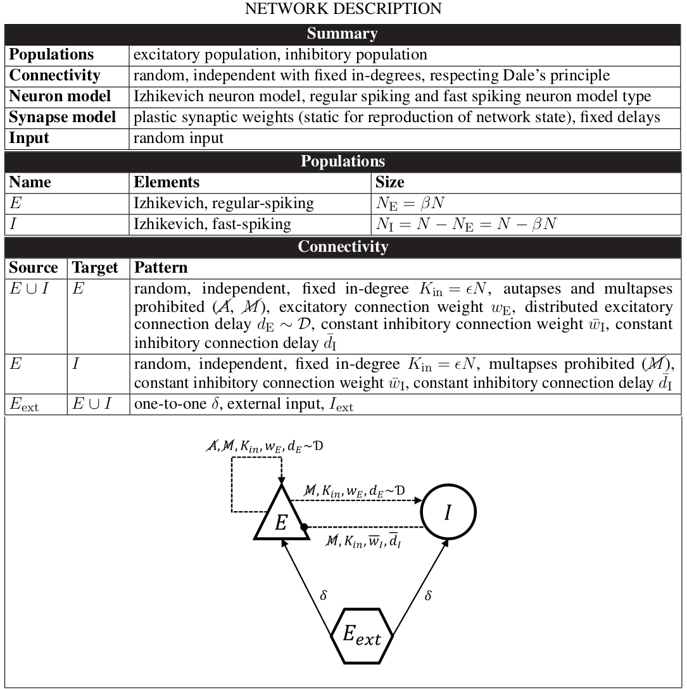
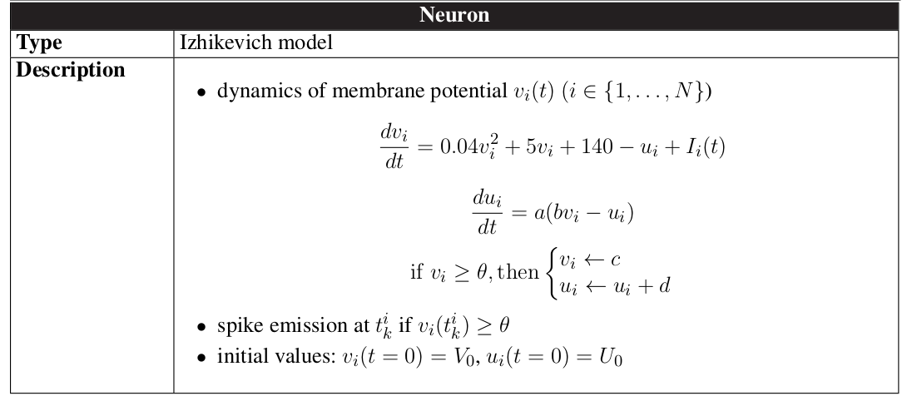
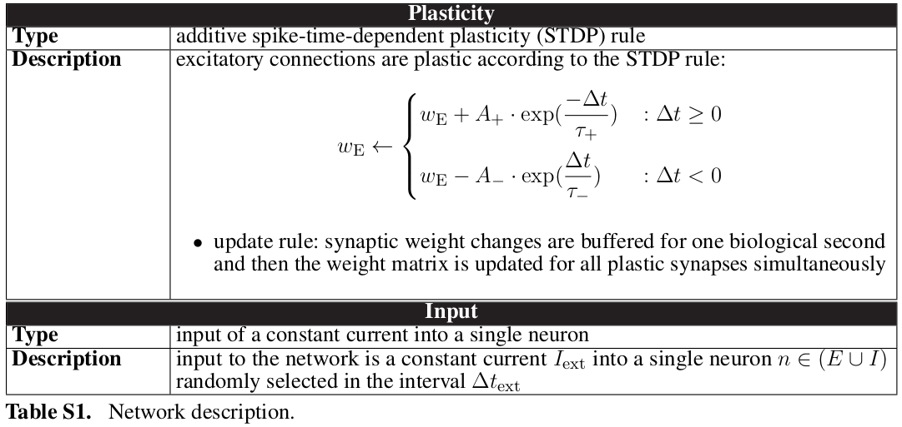
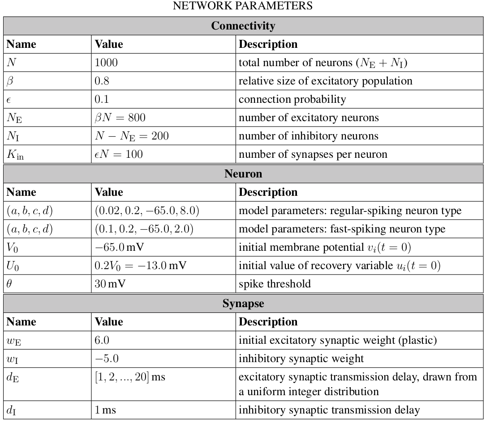
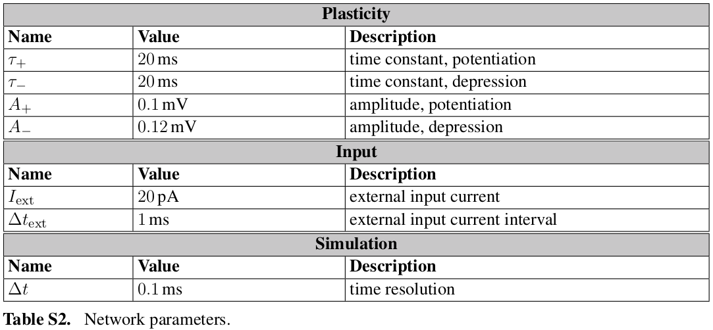

## Rigorous Neural Network Simulations ##

This repository contains the C/C++ source codes, PyNN and PyNEST scripts developed as part of the following studies:

*Trensch, G., Gutzen, R., Blundell, I., Denker, M., and Morrison, A. (2018). Rigorous neural network simulations: A model substantiation methodology for increasing the correctness of simulation results in the absence of experimental validation data. [Frontiers in Neuroinformatics 12, 81. doi:10.3389/fninf.
2018.00081](https://www.frontiersin.org/articles/10.3389/fninf.2018.00081/full)*

*Gutzen, R., von Papen, M., Trensch, G., Quaglio, P., Grün, S., and Denker, M. (2018). Reproducible neural network simulations: Statistical methods for model validation on the level of network activity data. [Frontiers in Neuroinformatics 12, 90. doi:10.3389/fninf.2018.00090](https://www.frontiersin.org/articles/10.3389/fninf.2018.00090/full)*

 

*Trensch, G., and Morrison, A. (2022). A System-on-Chip Based Hybrid Neuromorphic Compute Node Architecture for Reproducible Hyper-Real-Time Simulations of Spiking Neural Networks. [Frontiers in Neuroinformatics 16:884033.doi: 10.3389/fninf.2022.884033](https://www.frontiersin.org/articles/10.3389/fninf.2022.884033/full)*

## Codes ##

+ Console application to evaluate different ODE solver strategies for solving the Izhikevich neuron model dynamics. ([source](https://github.com/gtrensch/RigorousNeuralNetworkSimulations/tree/master/Evaluate_ODE_solver_implementations/src))
+ Implementations of the two-population Izhikevich network model described below:
  + C implementation implementation ([source](https://github.com/gtrensch/RigorousNeuralNetworkSimulations/tree/master/C_model))
  + SpiNNaker (PyNN) implementation ([source](https://github.com/gtrensch/RigorousNeuralNetworkSimulations/tree/master/SpiNNaker_model))
  + NEST (PyNEST) implementation ([source](https://github.com/gtrensch/RigorousNeuralNetworkSimulations/tree/master/NEST_model))

The codes were developed to explore different ODE solver strategies and to determine the required numerical precision needed to capture the dynamics of the Izhikevich neuron model [[2]](#2) with sufficient accuracy. The two-population Izhikevich network model described below and originally published in [[3]](#3), was used for a quantitative assessment of different implementations, namely: a reference implementation in the C language, a SpiNNaker PyNN implementation, an implementation using the NEST simulation tool, and an implementation on a novel neuromorphic compute node architecture.
The model was also used to perform benchmarking tasks.

## Two-Population Izhikevich Model ##

The Izhikevich neuron model was originally published in [[2]](#2) and the two-population network model in [[3]](#3). The tables (Tab. 1, 2) below summarize the properties and parameters of the network, following the proposed methods described in [[4]](#4) and [[6]](#6). In order to avoid the occurrence of simulation artifacts, the temporal resolution of the simulation is set to 0.1 ms. This is a 10 times smaller value than used by the original implementation [[3]](#3). See also [[5]](#5), in which the reproducibility of two-population Izhikevich network model was evaluated using the NEST simulator.

## References ##

<a id="1">[1]</a> *Gutzen, R., von Papen, M., Trensch, G., Quaglio, P., Grün, S., and Denker, M. (2018). Reproducible neural network simulations: Statistical methods for model validation on the level of network activity data. Frontiers in Neuroinformatics 12, 90. doi:10.3389/fninf.2018.00090*

<a id="2">[2]</a> *Izhikevich, E. M. (2003). Simple model of spiking neurons. Trans. Neur. Netw., 14(6):1569–1572.*

<a id="3">[3]</a> *Izhikevich, E. M. (2006). Polychronization: Computation with spikes. Neural Computation, 18:245–282.*

<a id="4">[4]</a> *Nordlie, E., Gewaltig, M.-O., and Plesser, H. E. (2009). Towards Reproducible Descriptions of Neuronal Network Models. PLoS Computational Biology, 5(8):e1000456.*

<a id="5">[5]</a> *Pauli, R., Weidel, P., Kunkel, S., and Morrison, A. (2018). Reproducing polychronization: A guide to maximizing the reproducibility of spiking network models. Frontiers in Neuroinformatics 12. doi:10.3389/fninf.2018.00046*

<a id="6">[6]</a> *Senk, J., Kriener, B., Djurfeldt, M., Voges, N., Jiang, H.-J., Schüttler, L., Gramelsberger, G., Diesmann, M., Plesser, H. E., and van Albada, S. J. (2021). Connectivity concepts in neuronal network modeling.*

<a id="7">[7]</a> *Trensch, G., Gutzen, R., Blundell, I., Denker, M., and Morrison, A. (2018). Rigorous neural network simulations: A model substantiation methodology for increasing the correctness of simulation results in the absence of experimental validation data. Frontiers in Neuroinformatics 12, 81. doi:10.3389/fninf.
2018.00081*

